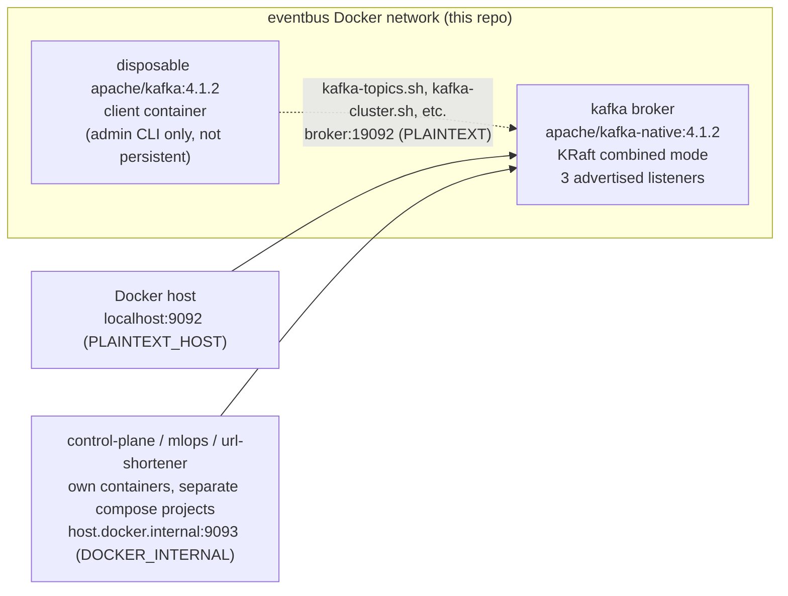

# agentic-sdlc-eventbus

Single-node Apache Kafka broker (KRaft mode, no ZooKeeper) that acts as the sole communication
channel between the other repos in the `agentic-sdlc-*` platform split, plus `agentic_events`:
the shared event contract those repositories install as a dependency.

This repo owns **no database** and runs **no producer/consumer processes of its own** — the broker
is infrastructure-only, and `agentic_events` is a contract library, not an application. Kafka
client code (subscription, publishing, retries) lives in each consuming repo, not here.

Repos carrying the `agentic-sdlc-*` prefix are domain-agnostic platform backbone. Nothing here may
describe a tenant service's internals — naming one in the topic register is fine, describing how it
works is not. If you find such a reference, it is a design defect.

**Why any of this is shaped the way it is** lives in [`docs/adr/`](docs/adr/) and
[`specs/`](specs/), never in this file. This file is how to run and use the repo.
The non-negotiables are in [`.specify/memory/constitution.md`](.specify/memory/constitution.md).

## Tech stack

- **Broker**: Apache Kafka (KRaft mode, no ZooKeeper) via `apache/kafka-native:4.1.2`
- **Package**: Python 3.12, [Pydantic](https://docs.pydantic.dev/) 2.10.4, PyYAML 6.0.2,
  jsonschema 4.23.0
- **Quality gates**: ruff 0.16.5 (lint + format), mypy 2.3.1 (`--strict`), pytest 8.3.4,
  pytest-cov 7.1.0
- **Broker-backed tests**: confluent-kafka 2.6.1 (optional extra, not required to install the package)
- **Infra**: Docker Compose, GitHub Actions CI

## Architecture



`apache/kafka-native` ships no CLI tooling (see [Testing](#testing)), which is why admin operations
run from a separate disposable container rather than `docker compose exec` into `broker`.

### The contract layer

Three things this repo publishes are declarative specs, shipped **inside** the package at
`src/agentic_events/contracts/` so they travel with the wheel:

| Spec | What it declares | Read by |
|---|---|---|
| `topics.yaml` | The topic register | `agentic_events.registry`, the README table below, broker reconciliation |
| `listeners.yaml` | Listener topology and the caller position each serves | `tests/contract/`, which asserts `docker-compose.yml` matches it |
| `schemas/*.schema.json` | Per-topic shape of the envelope's open `metrics`/`payload` pair | `registry.validate_event()` |
| `envelope/v1.0.schema.json` | The envelope's wire contract, generated from the model | Downstream diffs, the CI compatibility gate |

Each is meta-validated against its own JSON Schema. Nothing that belongs in a spec is a constant
in Python or a value typed twice into the compose file.

### Topic register

<!-- BEGIN GENERATED: topic-register -->

Generated from `src/agentic_events/contracts/topics.yaml` by `scripts/render_topic_table.py`. Convention: `{service}.{event-type}.v{n}`.

| Topic | Producer | Consumer(s) | Carries |
|---|---|---|---|
| `url-shortener.request-telemetry.v1` | `url-shortener-api` | `agentic-sdlc-mlops` | envelope |
| `mlops.drift-detected.v1` | `agentic-sdlc-mlops` | `agentic-sdlc-control-plane` | envelope |
| `control-plane.gate-decision.v1` | `agentic-sdlc-control-plane` | `agentic-sdlc-control-plane` | envelope |
| `control-plane.run-outcome.v1` | `agentic-sdlc-control-plane` | `agentic-sdlc-mlops` | envelope |
| `control-plane.audit.v1` | `agentic-sdlc-control-plane` | _none_ | envelope |
| `control-plane.dlq.v1` | `agentic-sdlc-control-plane` | _none_ | raw |

<!-- END GENERATED: topic-register -->

The register is `contracts/topics.yaml`; the table above is a generated view of it and CI fails if
the two disagree. **A topic that exists on a broker but not in the register is undocumented
infrastructure** — `tests/evaluation/` reconciles the two against a live broker in both directions.

Separator is `.`, words inside a segment join with `-`, never `_`: Kafka collapses `.` and `_` to
the same JMX metric name, so `foo.bar` and `foo_bar` would silently share metrics. Confirmed during
broker testing.

`control-plane.dlq.v1` carries **raw JSON, not an envelope**. A message reaches it precisely by
failing the envelope contract, so wrapping the report in that contract would destroy the evidence.

### Cross-repo connectivity

Each repo's own `docker-compose.yml` does not redeclare this broker — they connect to it as an
already-running external service. There is deliberately no shared multi-repo compose file, so
`docker compose up` in every repo stays independently runnable with no sibling checkout.

Three listeners exist because three **caller positions** exist, and one address cannot serve all
three:

| Caller position | Value to use | Listener |
|---|---|---|
| Containers on this repo's `eventbus` network | `broker:19092` | `PLAINTEXT` |
| The Docker host (CLI tools run directly, not in a container) | `localhost:9092` | `PLAINTEXT_HOST` |
| Containers in another repo's separate compose project | `host.docker.internal:9093` | `DOCKER_INTERNAL` |

A client that bootstraps successfully will still fail every subsequent produce and fetch if it is
handed a reconnect address it cannot reach. **Bootstrap succeeding proves nothing** — see
[ADR 0001](docs/adr/0001-dedicated-listener-for-cross-repo-containers.md).

Every listener is unauthenticated and `scope: local-dev-only`, declared explicitly in
`listeners.yaml` rather than left as an unstated default. Any non-local deployment needs SASL/TLS
and a superseding ADR, not a port change.

### Auto-topic-creation

`KAFKA_AUTO_CREATE_TOPICS_ENABLE=true`: any producer can publish to a not-yet-existing topic and
the broker creates it, with `KAFKA_NUM_PARTITIONS=3` and replication factor 1 (single broker — no
other value is possible). It gives zero control over per-topic partition counts, retention, or
compaction; every auto-created topic gets the cluster defaults.

**[ASSUMPTION]** 3 partitions and replication factor 1 are defensible for local/dev only.

Consumers still do not learn a topic exists until their next metadata refresh.
`agentic-sdlc-control-plane` uses pattern subscription rather than naming topics explicitly, and
bounds discovery latency with `metadata.max.age.ms` (default 300000 ms is too slow for
drift-to-run latency; ~30000 ms is the working value). That setting lives in its consumer config,
not here.

At real-cluster scale auto-create is replaced by explicit provisioning — a `kafka-topics.sh
--create` step in CI or a managed topic manifest — with partitions, replication, and retention
tuned deliberately. It is unacceptable in production because a typo silently creates a junk topic
instead of failing loudly, defaults are rarely right for every topic at once, and any authenticated
producer gains the implicit power to create unbounded topics with no approval gate. In this repo,
register reconciliation is the control that keeps the trade-off visible.

### Memory budget

One container, `kafka`, at `mem_limit: 2 GiB`, against an 8 GiB WSL2 allocation. The full
cross-repo budget table is authoritative in the platform's planning document, not duplicated here.

## Quick start

```bash
docker compose up -d
docker compose ps            # wait for STATUS = healthy
```

The broker is then reachable at the address for your caller position — see
[Cross-repo connectivity](#cross-repo-connectivity).

## Local development

```bash
python -m venv .venv && .venv/Scripts/activate   # or .venv/bin/activate on Linux/WSL
pip install -e ".[dev]"                          # add ,broker for the broker-backed tiers
```

### Using the contract

```python
from agentic_events import EventEnvelope, GitTarget, Producer
from agentic_events import registry
from agentic_events.telemetry import current_traceparent

envelope = EventEnvelope(
    event_id=uuid4(),
    correlation_id=episode_id,          # per EPISODE, not per message - see below
    service="agentic-sdlc-mlops",
    event_type="drift-detected",
    timestamp=datetime.now(timezone.utc),
    producer=Producer(service="agentic-sdlc-mlops", instance_id=hostname),
    git_target=GitTarget(repo_url="https://example.com/repo.git", branch="main"),
    scenario_type="brownfield",
    metrics={"metric_name": "p95_latency_ms", "threshold_pct": 20.0, ...},
    traceparent=current_traceparent(),   # None when no tracing SDK is installed
)

registry.validate_event(
    "mlops.drift-detected.v1", metrics=envelope.metrics, payload=envelope.payload
)
```

Three identifiers with three different lifetimes: `event_id` per message, `correlation_id` per
episode, `traceparent` per request path. Conflating the first two makes every redelivery look like
a new episode.

### Querying the register

```python
from agentic_events import registry

registry.topic_names()  # every registered topic
registry.topic("mlops.drift-detected.v1")  # producer, consumers, carries, schema
registry.listener("DOCKER_INTERNAL")  # bind, advertised, caller position
registry.event_schema("control-plane.audit.v1")
```

### Installing it into another repo

Pinned to a tag, never tracking `main`:

```
agentic-events @ git+https://github.com/jayakumar-devaraj/agentic-sdlc-eventbus.git@v0.1.0
```

This reuses the same HTTPS + fine-grained read-only PAT mechanism already required for
clone-per-run — no separate package registry needed.

### Changing the contract

Any change to the envelope, the register, or the listener topology starts as a spec:

```bash
python scripts/new_spec.py --contract-change "what you are changing"
```

Then, before opening a pull request:

```bash
python scripts/export_schema.py            # regenerate the wire contract
python scripts/render_topic_table.py       # regenerate the table above
```

### Extending it

| To do this | Change | Then |
|---|---|---|
| Add a topic | `contracts/topics.yaml` + a schema in `contracts/schemas/` named after it | `render_topic_table.py`; the contract tier asserts the pairing |
| Add an envelope field | `envelope.py` — optional with a default | `export_schema.py`; the compatibility gate proves it is additive |
| Change a listener | `contracts/listeners.yaml` **and** `docker-compose.yml` | Verify from that caller position; the contract tier asserts the two match |
| Add a rule the schema cannot express | `contract_violations()` in `envelope.py` | It warns by default; `validate_strict()` is the opt-in hard check |

## Testing

Four tiers, each answering a different question. The first two need nothing running.

```bash
pytest -m "unit or contract"        # every PR: schema, registry, compatibility gates
pytest -m "integration"             # needs a broker: real envelope, real wire
pytest -m "evaluation"              # needs a broker + Docker: the seam, per caller position
pytest                              # everything
```

| Tier | Question it answers |
|---|---|
| `unit/` | Does the schema reject what it should? Does the registry refuse a corrupt spec? |
| `contract/` | Would this change break a downstream repo? Does compose still match the listener spec? |
| `integration/` | Does a real envelope survive a real broker and come back validating? |
| `evaluation/` | Does each listener work **from the position it serves**? Does the register match the broker? |

Test traffic goes to `eventbus.test-*` topics, never a registered one.

### Unit test coverage report — `agentic_events`

```
Name                              Stmts   Miss  Cover
------------------------------------------------------
src/agentic_events/__init__.py        3      0   100%
src/agentic_events/envelope.py       59      0   100%
src/agentic_events/errors.py         13      0   100%
src/agentic_events/registry.py      132      0   100%
src/agentic_events/telemetry.py      37      0   100%
------------------------------------------------------
TOTAL                               244      0   100%
```

**100% over 244 statements, and the statement count is the point.** Full coverage of a Pydantic
model and a spec loader proves they reject what they were told to reject. It proves nothing about
whether the contract is the *right* contract — the correlation-id defect sat underneath a fully
covered envelope for weeks, because the envelope enforced that the field was a string and the
disagreement was about what the string *meant*. Treat this number as a weak signal. The
verification that carries weight is below.

### Functional verification report — broker

`apache/kafka-native` ships only the compiled `kafka.Kafka` binary — no `kafka-*.sh` tools are in
the image (confirmed by inspection: `/opt/kafka/bin/` does not exist). All admin verification runs
from a disposable `apache/kafka:4.1.2` client container. That is also why the compose healthcheck is
a bare TCP probe rather than a protocol-level check.

Every row was run against a real container, not asserted from reading the compose file.

| Check | Method | Result |
|---|---|---|
| Broker reaches `healthy` | compose healthcheck (TCP probe) | PASS — healthy within one 10s interval |
| KRaft mode confirmed (no ZooKeeper) | `kafka-cluster.sh cluster-id` via disposable client | PASS — returned pinned `CLUSTER_ID` |
| Auto-create on first produce | console-producer to a nonexistent topic, then `--list` | PASS — topic appeared |
| Auto-create defaults correct | `kafka-topics.sh --describe` | PASS — `PartitionCount: 3, ReplicationFactor: 1` |
| Cluster ID + topic data persist across `docker compose restart` | marker topic, restart, re-check | PASS — both survived |
| Cluster ID resets on `down -v` | `down -v`, `up`, re-check | PASS — behaves as designed |
| **Envelope round-trips a real broker** | `tests/integration/` — produce, consume, re-validate | PASS — including trace context and timezone-awareness intact after serialisation |
| **`PLAINTEXT` reachable from its caller position** | `kafka-broker-api-versions.sh` from a container on `eventbus` | PASS |
| **`DOCKER_INTERNAL` reachable from its caller position** | same, from a container with **no** shared network | PASS — the position ADR 0001 is about |
| **`PLAINTEXT_HOST` is *not* reachable from a foreign container** | same, negative case | PASS (correctly fails to connect) — if this ever succeeds, `DOCKER_INTERNAL` is redundant and ADR 0001 needs revisiting |
| **Register reconciles with the live broker** | `tests/evaluation/` — both directions | PASS — no undeclared topics; `control-plane.dlq.v1` registered ahead of first use |

These run as tests, not as a one-time manual check. Reproduce with:

```bash
docker compose up -d && pytest -m "integration or evaluation" -q
```

## Deployment / CI

| Workflow | Trigger | What it gates |
|---|---|---|
| `ci.yml` | pull request, manual | lint, `mypy --strict`, unit + contract tiers at 100% coverage, schema currency, README table currency, mermaid parse, broker health + auto-create |
| `contract-compat.yml` | pull request touching the package | The envelope schema on this branch against the one on `main`. A field becoming required fails the build. |
| `broker-tiers.yml` | nightly, manual | Integration and evaluation tiers against a real broker, including every caller position |
| `security.yml` | pull request, weekly | `pip-audit`, secret scan, SBOM |

There is deliberately **no `push: branches: [main]` trigger.** GitHub runs pull-request checks
against the merge result, so re-testing the merged tree pays twice for one answer. The gap that
leaves — the merge result is only the merged tree if `main` has not moved — is closed by *"Require
branches to be up to date before merging"*, which is **on**: the `main` ruleset carries
`strict_required_status_checks_policy: true`. `workflow_dispatch` is the escape hatch for running
on `main` deliberately.

Five checks are required to merge — the ones that run on every pull request. `contract-compat.yml`
is deliberately not among them: it is path-filtered, so on a docs-only change it never reports, and
requiring a check that sometimes never runs blocks the merge forever. **Renaming a job in
`ci.yml` breaks this**, because required checks match a job's display name rather than its key; the
ruleset must be updated in the same change.

Integration and evaluation run nightly rather than per-PR because they start a broker and pull
client images, and the platform's Actions allowance is a binding constraint. They are also
`workflow_dispatch`-able, and any change touching the seam should be run through them by hand
before merge.
