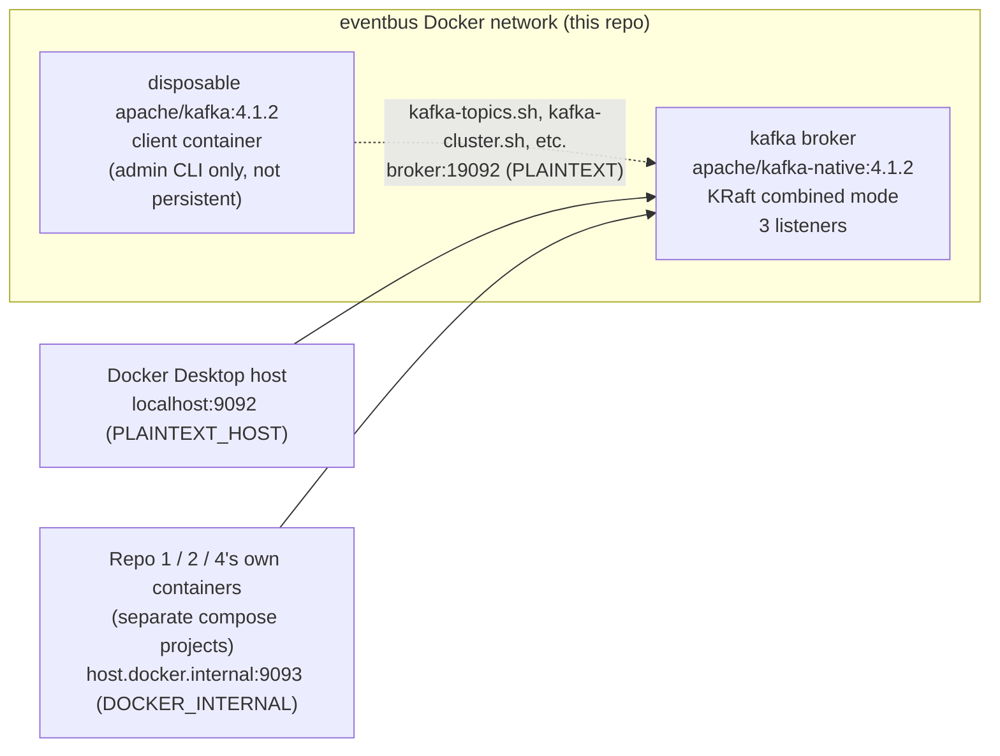

# agentic-sdlc-eventbus

Single-node Apache Kafka broker (KRaft mode, no ZooKeeper) that acts as the sole communication
channel between the other three repos in the `agentic-sdlc-*` platform split, plus the
`agentic_events` Python package: the shared event envelope contract that Repos 1, 2, and 4 install
as a dependency. This repo owns **no database** and runs **no producer/consumer processes of its
own** — the broker is infrastructure-only, and `agentic_events` is a contract library, not an
application. Actual Kafka client code (topic subscription, publishing, retries) lives in each
consuming repo, not here.

Repos `agentic-sdlc-control-plane`, `agentic-sdlc-mlops`, and `agentic-sdlc-eventbus` (this repo)
are domain-agnostic platform backbone. Nothing in this repo may reference `url-shortener-api`
concepts — if you find such a reference, it's a design defect.

## Tech stack

- **Broker**: Apache Kafka (KRaft mode, no ZooKeeper) via `apache/kafka-native:4.1.2`
- **Package**: Python 3.12, [Pydantic](https://docs.pydantic.dev/) 2.10.4 (`agentic_events` — the
  shared event envelope contract)
- **Testing**: pytest 8.3.4, pytest-cov 7.1.0
- **Infra**: Docker Compose, GitHub Actions CI

## Architecture



`apache/kafka-native` ships no CLI tooling (see Verification below), which is why admin operations
run from a separate disposable container rather than `docker compose exec` into `broker` itself.

## Quick start

```bash
docker compose up -d
docker compose ps            # wait for STATUS = healthy
```

Broker is reachable at `localhost:9092` from the host, `broker:19092` from other containers on the
same Docker network, or `host.docker.internal:9093` from containers in a different compose project
(see [Cross-repo connectivity](#cross-repo-connectivity)).

## Topic naming convention

```
{service}.{event-type}.v{n}
```

No tenant segment — the platform is single-tenant today. Examples used by the other repos:

| Topic | Producer | Consumer(s) |
|---|---|---|
| `url-shortener.request-telemetry.v1` | Repo 4 | Repo 2 |
| `mlops.drift-detected.v1` | Repo 2 | Repo 1 |
| `control-plane.gate-decision.v1` | (human/UI, relayed by Repo 1's decision API) | Repo 1 |
| `control-plane.run-outcome.v1` | Repo 1 | Repo 2 |

This convention is locked once any producer ships against it — changing it later requires
touching every repo's producer/consumer config, not just this one.

**Caveat confirmed during testing**: Kafka warns when topic names mix `.` and `_` in the same
position, since both collapse to the same JMX metric name internally (e.g. `foo.bar` and `foo_bar`
would collide). Our convention uses only `.` as a separator and `-` inside service names
(`url-shortener`, not `url_shortener`) — never `_` — so this doesn't apply today. Don't introduce
an underscore into a topic name without re-checking this.

## `agentic_events` package

The shared envelope contract, as a Pydantic model mirroring the JSON Schema in the plan doc's
section 2 (`EventEnvelope`, `Producer`, `GitTarget`). Scope is deliberately narrow: envelope shape
validation only — no topic-name helpers, no Kafka client wrapper, no serialization convenience
functions. Each consuming repo owns its own producer/consumer code and imports this only for a
consistent, validated envelope shape.

```python
from agentic_events import EventEnvelope, GitTarget, Producer

envelope = EventEnvelope(
    event_id=...,
    correlation_id=run_id,
    service="agentic-sdlc-mlops",
    event_type="drift-detected",
    timestamp=...,
    producer=Producer(service="agentic-sdlc-mlops", instance_id=hostname),
    git_target=GitTarget(repo_url="https://github.com/jayakumard10/url-shortener-api.git", branch="main"),
    scenario_type="brownfield",
    metrics={"p95_latency_ms": 61.8},
)
```

**Installing it into another repo** — pinned to a tag, never tracking `main`:

```
agentic-events @ git+https://github.com/jayakumard10/agentic-sdlc-eventbus.git@v0.1.0
```

This reuses the same HTTPS + fine-grained read-only PAT credential mechanism already required for
clone-per-run (locked decision 3) — no separate package registry needed.

**Running its tests locally:**

```bash
python -m venv .venv && .venv/Scripts/activate   # or .venv/bin/activate on Linux/WSL
pip install -e ".[dev]"
pytest --cov=agentic_events --cov-report=term-missing --cov-fail-under=100
```

## Plug-and-play strategy (this repo's half)

**(a) Auto-topic-creation** — `KAFKA_AUTO_CREATE_TOPICS_ENABLE=true` means any producer can
publish to a not-yet-existing topic and the broker creates it on the fly, with
`KAFKA_NUM_PARTITIONS=3` and replication factor 1 (single broker — no other value is possible
node-count-wise). **What it does not solve**: consumers still don't know a topic exists until
their next metadata refresh — see (b) — and it gives zero control over per-topic partition
counts, retention, or compaction; every auto-created topic gets the cluster defaults above.
**[ASSUMPTION]** 3 partitions/topic and replication factor 1 are defensible only for local/dev —
flagged again in the memory budget & production section below.

**(b) Consumer-side pattern subscription** — locked decision 5 requires Repo 1's consumer to use
`consumer.subscribe(pattern=...)` rather than naming topics explicitly, so it can react to
`agentic-sdlc-mlops` and future services without a code change. Discovery latency is governed by
the consumer's `metadata.max.age.ms`:
- Default (300000 ms / 5 min): a topic auto-created by Repo 2 can take up to 5 minutes to appear
  in Repo 1's subscription — unacceptable for drift-to-run latency.
- Repo 1 must tune this down (e.g. 30000 ms / 30 s) to bound discovery latency to well under a
  minute. Trade-off: every consumer instance in the group issues a full metadata request that
  often, adding broker-side load that scales with `(number of consumers) / metadata.max.age.ms`.
  At 30s and a handful of consumers this is negligible; it stops being negligible in the
  hundreds-of-consumers range, which this platform is nowhere near.
- This setting lives in Repo 1's consumer config, not here — noted here because it's the
  direct consequence of this repo's auto-create default.

**(e) What replaces auto-create at real-cluster scale**: explicit topic provisioning (e.g. a
`kafka-topics.sh --create` step in CI, or a Terraform/Ansible-managed topic manifest) checked in
per-repo, with per-topic partition/replication/retention tuned deliberately. Auto-create is
unacceptable in production because (1) a typo in a producer's topic name silently creates a
junk topic instead of failing loudly, (2) every auto-created topic inherits cluster-wide
defaults that are almost never right for every topic at once, and (3) it gives any authenticated
producer the implicit power to create unbounded topics — a resource-exhaustion vector with no
approval gate.

## Memory budget

This repo's compose file runs **one** container, `kafka`, at `mem_limit: 2 GiB`. The full four-repo
cross-repo budget table (checked against the 8 GiB WSL2 allocation) is authoritative in the internal
planning document's Infrastructure Manifests section, not duplicated here — update it there, not
here, as repos 1, 2, and 4 are built.

## Cross-repo connectivity

Wired and verified 2026-07-26 (against `url-shortener-api`, the first consuming repo). Each repo's
own `docker-compose.yml` does *not* redeclare this broker — they connect to it as an already-running
external service, since locked decision 7 forbids a shared multi-repo compose file. This keeps
`docker compose up` in every repo independently runnable with no sibling checkout. The broker
exposes **three listeners** because "how a client reconnects for produce/fetch" (the *advertised*
address, not just the address it initially connects to) genuinely differs by caller position — one
address cannot correctly serve all three:

| Caller | Value | Listener |
|---|---|---|
| Containers on this repo's own `eventbus` network | `broker:19092` | `PLAINTEXT` |
| Host machine (Windows/WSL2, e.g. CLI tools run directly, not in a container) | `localhost:9092` | `PLAINTEXT_HOST` |
| Containers in another repo's own separate compose project | `host.docker.internal:9093` | `DOCKER_INTERNAL` |

A bug in the original design (reusing `PLAINTEXT_HOST` for cross-repo access) and the fix that led
to this three-listener setup are documented in `docs/adr/0001`.

## Verification

`apache/kafka-native` ships only the compiled `kafka.Kafka` binary — no `kafka-*.sh` CLI tools are
in the image (confirmed by inspection: `/opt/kafka/bin/` doesn't exist). All admin/CLI verification
below runs from a disposable `apache/kafka:4.1.2` (JVM, full tooling) client container attached to
this repo's `eventbus` Docker network, talking to the broker's internal listener at `broker:19092`.
This is why the compose file's own healthcheck is a bare TCP probe rather than a protocol-level
check — see the comment in `docker-compose.yml`.

```bash
# Broker health / API versions
docker run --rm --network eventbus apache/kafka:4.1.2 \
  /opt/kafka/bin/kafka-broker-api-versions.sh --bootstrap-server broker:19092

# Confirm KRaft mode (no ZooKeeper) and cluster id
docker run --rm --network eventbus apache/kafka:4.1.2 \
  /opt/kafka/bin/kafka-cluster.sh cluster-id --bootstrap-server broker:19092

# Prove auto-create: publish to a topic that doesn't exist yet, then list + describe it
echo "smoke-test" | docker run --rm -i --network eventbus apache/kafka:4.1.2 \
  /opt/kafka/bin/kafka-console-producer.sh --bootstrap-server broker:19092 \
  --topic url-shortener.request-telemetry.v1
docker run --rm --network eventbus apache/kafka:4.1.2 \
  /opt/kafka/bin/kafka-topics.sh --list --bootstrap-server broker:19092
docker run --rm --network eventbus apache/kafka:4.1.2 \
  /opt/kafka/bin/kafka-topics.sh --describe --topic url-shortener.request-telemetry.v1 \
  --bootstrap-server broker:19092   # expect PartitionCount: 3, ReplicationFactor: 1

# Consumer-group lag (once a real consumer group exists in Repo 1)
docker run --rm --network eventbus apache/kafka:4.1.2 \
  /opt/kafka/bin/kafka-consumer-groups.sh \
  --bootstrap-server broker:19092 --describe --group <consumer-group-name>
```

### Unit test coverage report — `agentic_events`

```
Name                         Stmts   Miss  Cover   Missing
----------------------------------------------------------
agentic_events\__init__.py       2      0   100%
agentic_events\envelope.py      29      0   100%
----------------------------------------------------------
TOTAL                           31      0   100%
```

8 tests in `tests/test_envelope.py`: valid-envelope defaults, rejection of unknown top-level fields
(`extra="forbid"`), rejection of an invalid `scenario_type` or wrong `schema_version`, `commit_sha`
allowed null pre-clone, and that `metrics`/`payload` accept arbitrary event-specific shapes. 100%
coverage is enforced in CI (`--cov-fail-under=100`) — reasonable for a package this small and
schema-focused; revisit the threshold if the package grows scope later.

### Functional verification report — broker

The broker itself has no application code to unit-test — the table below is its QA deliverable
instead: every row was actually run against a real container, not asserted from reading the compose
file.

| Check | Method | Result |
|---|---|---|
| Broker reaches `healthy` | compose healthcheck (TCP probe) | PASS — healthy within one 10s interval |
| KRaft mode confirmed (no ZooKeeper) | `kafka-cluster.sh cluster-id` via disposable client | PASS — returned pinned `CLUSTER_ID: GbUkriPcWUY1D0RM32nhAw` |
| Auto-create on first produce | console-producer to nonexistent topic, then `--list` | PASS — topic appeared |
| Auto-create defaults correct | `kafka-topics.sh --describe` | PASS — `PartitionCount: 3, ReplicationFactor: 1` |
| Cluster ID + topic data persist across `docker compose restart` | created a marker topic, ran `docker compose restart kafka`, re-checked cluster-id and topic list | PASS — both survived the restart |
| Cluster ID correctly resets on `down -v` (volume removed) | `down -v` then `up`, re-checked cluster-id | PASS — behaves as designed, not a regression |
| `DOCKER_INTERNAL` listener reachable and correctly advertised from a container with no shared network | produced from a bare `docker run` container (no `--network eventbus`) via `host.docker.internal:9093`, consumed the message back via the internal network | PASS, after fixing the `PLAINTEXT_HOST`-reuse bug above — message was both accepted and actually retrievable, not just accepted |

This same sequence (health wait + auto-create validation) is what `.github/workflows/ci.yml` runs
on every push/PR — the report above isn't a one-time manual check, it's continuously re-verified.

## Phase 2 note

Nothing in this repo changes for Phase 2 (real ML model in Repo 2). The event bus is
schema-and-topic-convention driven, not payload-aware — a new topic or a v2 envelope field is a
Repo 1/2/4 concern, not a broker reconfiguration here.
